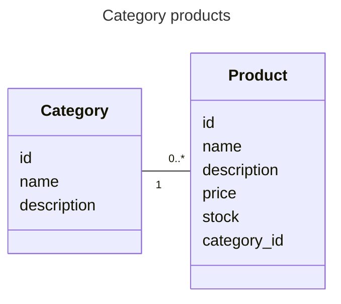
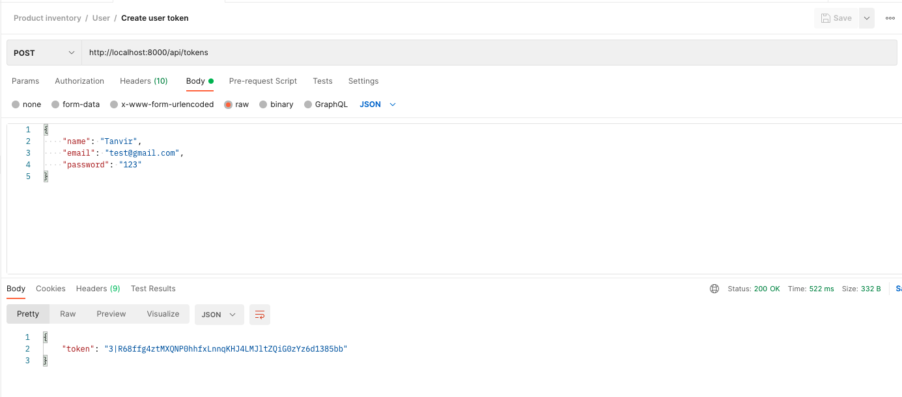

# Product inventor

-   The goal is to build a <ins>RESTful API</ins> that allows users to manage a product inventory.

-   System requirements
    -   [x] Use MySQL database to store data (products, categories)
    -   [x] SQL script to create database structure
    -   [x] Implement models with Eloquent ORM to interact with the database (note: SQL injection prevention)
    -   [x] Product Category CRUD
    -   [x] Product CRUD
    -   [x] API Security: validation
    -   [x] Security: token-based authentication system with [Sanctum library](https://laravel.com/docs/10.x/sanctum). Will use default _User_ model to store token in _users_ table

## Technologies

-   PHP/**Laravel** (v10.40) with [PHP Code Style Fixer](https://github.com/PHP-CS-Fixer/PHP-CS-Fixer)

## Diagram



## Getting started

-   Requirements
    -   PHP +v8 (with web server)
    -   Composer
    -   Database MySQL + GUI database (i.e: DataGrip || DBeaver)

-   Execution

    ```bash
    # Install dependencies
    composer install
    php artisan key:generate


    # Setup local database (localhost:xxxx): assuming that already mysql database engine is installed
    cp .env.example .env    # add DB information

      # Create Database: 2 options
        # 1) With migration
        php artisan migrate
        # 2) With sql creates
        cd doc; mysql -u <your-username> -p < db_skeleton.sql

      # Populate DB: 2 options
        # With Seeders
        php artisan db:seed
        # With SQL inserts
        cd doc; mysql -u <your-username> -p < db_dump.sql

    # Execute migration for token-based authentication
    php artisan migrate

    # Launch server
    php artisan serve --port=8000
    ```

## Demo

-   [Give a look to Postman API endpoint](./doc/Product%20inventory.postman_collection.json)
-   Authentication to create token: POST [server_route]/api/categories
-   Category endpoints (need token)
    -   POST [server_route]/api/categories
    -   GET [server_route]/api/categories/{id}
    -   GET [server_route]/api/categories
    -   PUT [server_route]/api/categories/{id}
    -   DELETE [ [server_route]]/api/categories/{id}
-   Product endpoints (need token)

    -   POST [server_route]/api/products
    -   GET [server_route]/api/products/{id}
    -   GET [server_route]/api/products
    -   GET [server_route]/api/categories/{category_id}/products
    -   PUT [server_route]/api/products/{id}
    -   DELETE [server_route]/api/products/{id}

<p align='center'></p>

## Notes

-   IDE: PhpStorm
-   Architectural pattern: the one suggested by Laravel to structure code base, <ins>MVC architecture</ins> to separate the logic of the app into three parts in which we will not give importance to the Views. Note: Controller (logic) + Model (interact with DB)
-   DB connection (automatically): check _.env_ so that Laravel can make a connection, <ins>don't need PDO to connect with DB</ins>, instead ORM will do it.

## Improvements

-   Use Repository pattern
-   Use Registry pattern: Logger
-   Use AppException pattern
-   Use Enums
-   Add Test coverage
-   Add Swagger for endpoint documentation
